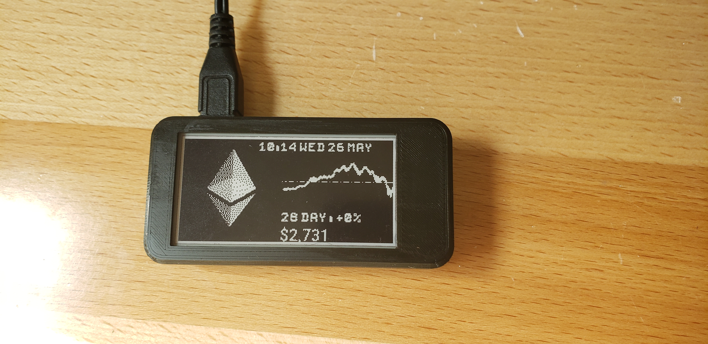

# Cryptocurrency ePaper Ticker Waveshare 2.13inch(b)
(supports all 6000+ coins/currencies listed on [CoinGecko](https://api.coingecko.com/api/v3/coins/list))

A Python3 ePaper Cryptocurrency price ticker that runs on a Raspberry Pi connected to a [Waveshare 2.13 inch model b ePaper display](https://www.waveshare.com/wiki/2.13inch_e-Paper_HAT). The script periodically (every 1.5 mins by default) takes data from CoinGecko and prints a summary to the ePaper.

A few minutes work gives you a desk ornament that will tastefully monitor a coin's journey moonward.



Please note there is no support for Red Images(yet). This to make a black and white image that is compatible with the 2.13inch(b) waveshare.

# Getting started

## Supplies (Hopefully the links are still good)

- [Raspberry Pi Zero W (with Headers) - $14](https://www.adafruit.com/product/3708)
- [Waveshare 2.13 Inch Eink Display HAT Model B - ~$22](https://www.amazon.com/waveshare-2-13inch-HAT-Resolution-Raspberry/dp/B07Q22WDB9/ref=pd_lpo_147_t_2/136-6565877-3985041?_encoding=UTF8&pd_rd_i=B07Q22WDB9&pd_rd_r=52b68f29-0a3f-4ffc-9215-b70a143296e5&pd_rd_w=F78l6&pd_rd_wg=bTZpi&pf_rd_p=a0d6e967-6561-454c-84f8-2ce2c92b79a6&pf_rd_r=V4Y8D0T72565N8RYDN6N&psc=1&refRID=V4Y8D0T72565N8RYDN6N)
- [5v 2.5A Powersupply with microUSB Cable - $7.50](https://www.adafruit.com/product/1995)

Case is a STL(for 3d printing) file I found online and modified. I can't remember who made the original case. 

## Prerequisites

(These instructions assume that your Raspberry Pi is already connected to the Internet, happily running pip and has Python3 installed)

If you are running the Pi headless, connect to your Raspberry Pi using ssh.

Install the Waveshare Python module following the instructions on their [Wiki](https://www.waveshare.com/wiki/2.7inch_e-Paper_HAT) under the tab Start with Raspberry Pi.

(To install the waveshare_epd python module, you need to run the setup file in their repository - also, be sure not to install Jetson libraries on a Pi)

When following the Wiki, make sure you are running the demo python script for the 2in13b.

```
cd e-Paper/RaspberryPi_JetsonNano/python
sudo python3 setup.py install
```
## Install & Run

Copy the files from this repository onto the Pi, or clone using:

```
cd ~
git clone https://github.com/kinglurtz/btcticker.git
cd btcticker
```


Install the required modules using pip:

```
python3 -m pip install -r requirements.txt
```

If you'd like the script to persist once you close the session, use [screen](https://linuxize.com/post/how-to-use-linux-screen/).

Start a screen session:

```
screen bash
```

Run the script using:

```
python3 btcticker2in13b.py
```

Detatch from the screen session using CTRL-A followed by CTRL-D

The ticker will now pull data every 10 minutes and update the display. 

# Interface

The waveshare 2.13inch(b) is different from the standard 2.13 inch version because it has Black and Red ink. This also means that the API to update the screen is different. When sending a display update to the screen you must provide both the black and red image to display(even if there is no black or red)

Update frequency can be changed in the config.yaml file (default is 90 seconds).

# Setting up auto start for python script

For this I used the crontab command.
```
crontab -e
```
Select your editor of choice (I used nano)

Go all the way to the bottom of the commented text(I pick the bottom because it keeps my crontab list organized if it is all in the same place.)
```
@reboot python3 <Path to btcticker2in13b.py> &
```
Now on reboot your pi will start the python script. The added '&' at the end of the line makes sure the python script is started as a background process. 

Side note: If you are using a PiZero W(I personally recommend doing so) the start up process may take a minute or two.

# Links from llvllch repo for 2.7 inch version
[](https://youtu.be/DNLUmJb7Mj8) 
- Video of the unit working [here](https://youtu.be/DNLUmJb7Mj8)
- A low(er)-effort kit and frames can be obtained at [veeb.ch](http://www.veeb.ch/store/p/cryptocurrency-ticker)

# Troubleshooting

Some people have had errors on a clean install of Rasbian Lite on Pi. If you do, run:

```
sudo apt-get install libopenjp2-7
sudo apt-get install libqt5gui5
sudo apt-get install python-scipy
sudo apt install libatlas-base-dev
```

and re-run the script.

If the unit is freezing, try switching to another power supply. 

# Licencing

GNU GENERAL PUBLIC LICENSE Version 3.0
